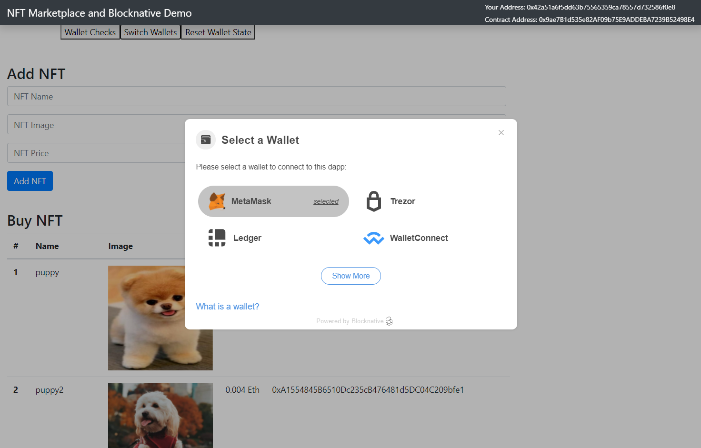

# **NFT Flow on Ethereum blockchain**

I am designing a decentralized marketplace which can be further extended to meet specific requirements. 



This is a marketplace that runs on the blockchain. It allows individuals to list "NFTs" for sale and to purchase them on the website with Ethereum in the Ropsten network. This application is powered by a smart contract on the blockchain which manages the market place. For example it tracks who owns the "NFT" for sale, and it automatically transfers the ownership of it when a transaction is complete.


### Features
- Mint custom ERC721 implemented NFT.
- Buy token on the marketplace.
- Keeps track of all the tokens owned by an account - minted and bought.
- Query blockchain for token owner and token metadata.


### **Languages and Tools**
- [Solidity](https://docs.soliditylang.org/en/v0.7.6/) for Smart contract.

- [Truffle](https://www.trufflesuite.com/truffle) to compile, test and deploy contracts.

- [Ganache](https://www.trufflesuite.com/ganache), a personal Ethereum blockchain made it easy for us to observe the process and transactions during testing.

- [web3.js](https://web3js.readthedocs.io/en/v1.3.4/) to interact with a local or remote ethereum node using HTTP, IPC or websocket.

- [blocknative](https://docs.blocknative.com/onboard) makes it easy to access wallets and work with every other aspects of Web3.

- [Metamask](https://docs.metamask.io/guide/getting-started.html), crypto wallet allows to store and transact Ethereum or any other ERC tokens.


### Interact with the deployed DApp
Connect metamask browser wallet to Ropsten Test Network.

Request and get test etheres for the metamask account from [Ropsten Faucet](https://faucet.ropsten.be/) to make transactions.

Marketplace Smart Contract is deployed to Ropsten Testnet - [0x9ae7B1d535e82AF09b75E9ADDEBA7239B52498E4](https://ropsten.etherscan.io/address/0x9ae7B1d535e82AF09b75E9ADDEBA7239B52498E4)


### Run the DApp Locally
#### Install truffle
```
yarn install -g truffle
```
#### Install ganache-cli
```
yarn add ganache-cli
```
#### Run ganache-cli
```
ganache-cli --port 7545 --quiet
```
#### Install dependencies
```
yarn install
```
#### Compile smart contract
```
truffle compile
```
#### Deploy smart contract to ganache
```
truffle migrate
```
#### Test smart contract
```
truffle test
```
#### Start DApp
```
yarn run start
```
#### Open metamask browser wallet and connect network to Localhost 7545.
#### Import accounts from ganache-cli into the metamask browser wallet to make transactions on the DApp.


### **Sources**
* [How To Build A Blockchain App ](https://www.dappuniversity.com/articles/how-to-build-a-blockchain-app#dependencies)
* [Get Ropsten Ethereum](https://medium.com/bitfwd/get-ropsten-ethereum-the-easy-way-f2d6ece21763)
* [Infura](https://infura.io) 
* [Ropsten Ethereum Faucet](https://faucet.ropsten.be)
* [React](https://reactjs.org)
* [OpenZeppelin](https://openzeppelin.com/contracts/)
